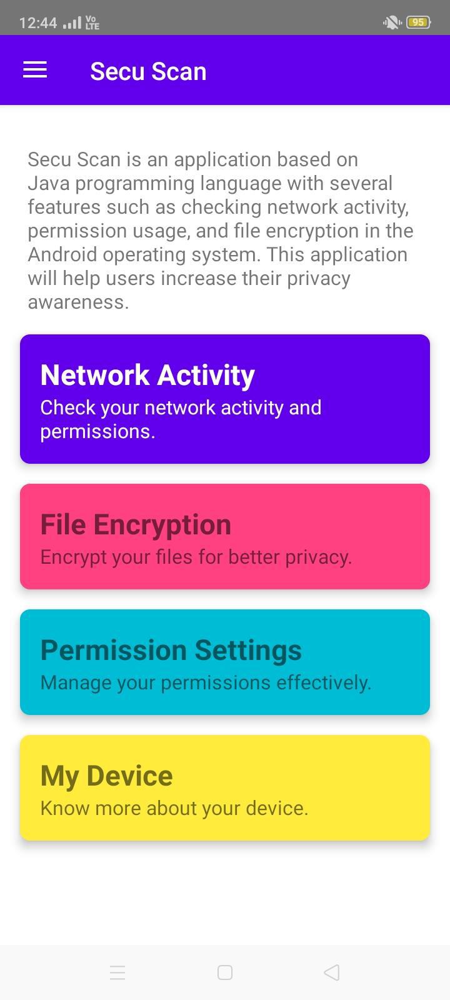
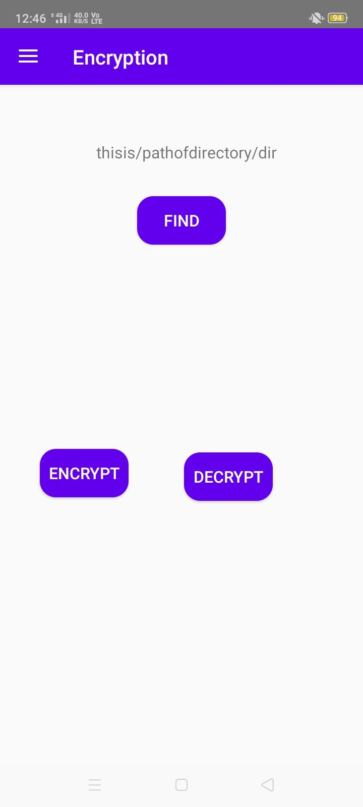

# 🛡️ SecuScan – Android Security & Device Monitoring App

**SecuScan** is a comprehensive Android security application designed to monitor device behavior, app permissions, network activity, and system-level configurations. It empowers users with insights into their device’s privacy and security posture, providing a clean and intuitive dashboard with real-time feedback.

---

## 📲 Features

### 🔐 Dashboard Overview
- Real-time status of device security
- Summary of risky apps, permissions, and activity

### 🔍 Permission Scanner
- Lists installed apps with categorized permissions
- Highlights apps with high-risk access (e.g., camera, contacts, location)

### 📋 Permission Check
- View app-specific permissions in detail
- Categorized flags for easier risk understanding

### 🌐 Network Monitor
- Displays local/public IP, connection type, ISP
- Tracks real-time upload/download bandwidth

### ⚙️ Device Information
- Shows OS version, model, CPU, RAM, and other hardware info

### 🔐 Encryption Status
- Identifies if device is encrypted (FBE/FDE)
- Provides insight into device-level data protection

---

## 🧱 Built With

| Component       | Description                                  |
|----------------|----------------------------------------------|
| Language        | Java                                         |
| Architecture    | MVVM (Model-View-ViewModel)                  |
| UI Framework    | Material Design                              |
| APIs Used       | Android PackageManager, ConnectivityManager |
| Tools           | Android Studio, Android SDK, VirusTotal API, Kapersky API |

---

## 📸 Screenshots

| Feature                  | Screenshot                         |
|--------------------------|-------------------------------------|
| Dashboard                |  |
| IP Finder & Network Info |  |
| Device Info              |  |
| Encryption Status        |  |
| Network Usage            |  |
| Permission List          |  |
| Permission Check Detail  |  |

> Store all images in a `screenshots/` folder inside the root project directory.

---


## 🚀 Getting Started

1. Clone the repository:
   ```bash
   git clone https://github.com/yourusername/SecuScan.git
